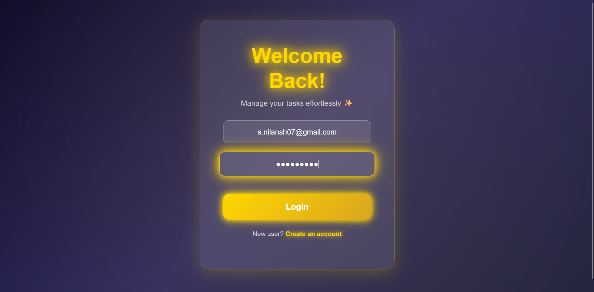
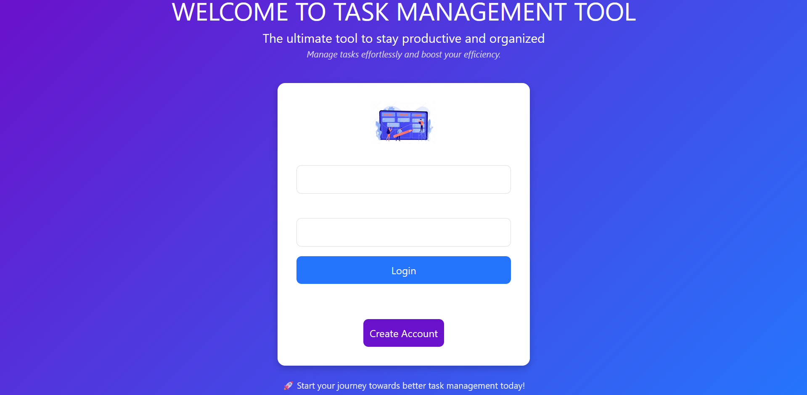

src/images/frontpage.png
## Task Management Project
A real-time task management system with AI-powered task suggestions, built using Golang (Gin/Fiber), Next.js (TypeScript), PostgreSQL, and WebSockets.
🏆 Built as part of the Full-Stack Rapid Development Challenge (4-hour challenge).

## Features
User Authentication – Sign up, log in, and log out
Task Management – Create, update, and delete tasks
Task Completion Status – Mark tasks as completed or pending
Task Filtering & Search – Filter tasks by status and search using keywords
User Profile – View and edit profile details
Responsive Design – Optimized for all screen sizes

Installation
Follow these steps to set up the project:

1. Clone the repository
   ```bash
   git clone https://github.com/Nilansh7/LiveTasks.git
   cd Task_management/Task_management
    ```

2. Install dependencies
   ```bash
   npm install
   ```
   
 3. Start the backend server
   ```bash
   npm start
   ```


## Approach for Full-Stack Rapid Development Challenge

This challenge requires speed, high agency, and effective AI utilization. The best approach is to prioritize MVP (Minimum Viable Product) while keeping code modular and scalable for future improvements. Below is a structured approach:

1️⃣ Planning 
Understand Requirements: Identify essential features (Authentication, Task Management, AI Suggestions, Real-time updates).
## **Tech Stack Decisions:**

- Backend: Golang (Gin for simplicity) + PostgreSQL (fast relational DB)

- Frontend: Next.js (App Router) + Tailwind CSS for rapid UI development

- Real-time Updates: WebSockets with Goroutines

AI Suggestions: OpenAI/Gemini API

- Deployment: Backend → Render/Fly.io | Frontend → Vercel

## High-Level Architecture:

- Frontend → Next.js (UI + API calls + WebSockets)

- Backend → Golang REST API (Auth, CRUD, WebSockets, AI)

- Database → PostgreSQL (ORM: GORM)

2️⃣ Backend - Golang 
🔹 Setup Project & Dependencies

- Initialize Go project:

```bash
go mod init task-management
go get github.com/gin-gonic/gin github.com/golang-jwt/jwt/v5 gorm.io/gorm gorm.io/driver/postgres github.com/gorilla/websocket
```
Configure Gin and PostgreSQL connection

🔹 User Authentication (JWT)

- Implement /auth/register and /auth/login
Use JWT for session handling

🔹 Task Management API (CRUD)

```bash /tasks/create, /tasks/update, /tasks/delete, /tasks/get```
Store tasks in PostgreSQL

🔹 WebSockets for Real-Time Updates

- Set up Goroutines and WebSockets (/tasks/ws) for instant task updates
  
🔹 AI-Powered Task Breakdown

- Integrate OpenAI/Gemini API (/tasks/suggest)
Input: Task title & description → AI suggests breakdowns

🔹 Deploy Backend to Render/Fly.io

Create a Dockerfile
Deploy using flyctl or render.yaml

3️⃣ Frontend - Next.js + Tailwind (1.5 Hours)

🔹 Project Setup
Initialize Next.js with Tailwind


```bash
npx create-next-app@latest task-management --typescript
cd task-management
npm install @mui/material axios jwt-decode
```
Configure Tailwind CSS

🔹 Authentication (JWT)

Login & Register pages
Store JWT in localStorage/sessionStorage

🔹 Task Dashboard (Real-time UI)

Task CRUD UI (Cards with Edit/Delete)
Real-time WebSockets (Use useEffect to listen for updates)

🔹 AI Task Suggestions

Button: "Generate Task Breakdown" → Calls OpenAI API
Display AI-recommended breakdown

🔹 Deploy on Vercel


```bash
vercel
```

